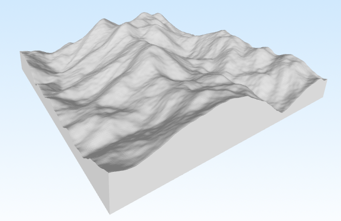

# MapGenerator

Procedural map generator written in Go.

This project contains a set of modules for generating heightmaps and
visualizing them using noise functions (Perlin noise) and
terrain-modification operations (terraforming). It is suitable for
experimenting with landscape generation, creating tile maps, or as an
educational example of a modular generator architecture.

------------------------------------------------------------------------

## Contents

```text
.
├── Generation
│   └── map_generator.go
├── Images
│   └── example1.png
├── MatrixTools
│   ├── matrix.go
│   └── matrix_tools.go
├── PerlinNoise
│   ├── noise.go
│   ├── perlin.go
│   ├── permutation.go
│   └── tools.go
├── README.md
├── Teraforming
│   ├── blur.go
│   ├── high_range.go
│   ├── map.go
│   └── thermal_erosion.go
├── Visualization
│   └── obj.go
├── go.mod
└── main.go

```

-   `main.go` - application entry point.
-   `Generation/` - logic for combining generation steps.
-   `MatrixTools/` - utilities for matrix operations (map represented
    as matrix).
-   `PerlinNoise/` - implementation/wrappers for noise functions
    (Perlin, etc.).
-   `Teraforming/` - terrain transformation operations (smoothing,
    normalization, randomization, etc.).
-   `Visualization/` - tools for rendering/exporting results.

------------------------------------------------------------------------

## Features

-   Heightmap generation with noise functions.
-   Terrain transformations to produce islands, mountains, and plains.
-   Matrix manipulation utilities.
-   Visualization/export tools.

------------------------------------------------------------------------

## Requirements

-   Go 1.18+ (latest recommended)

------------------------------------------------------------------------

## Quick Start

1. Clone the repository:

``` bash
git clone https://github.com/bukhuk/MapGenerator.git
cd MapGenerator
```

2. Build

``` bash
go build main.go
./main # n - 256, m - 256, seed - random
./main n 100 m 200 seed 42 # n - 100, m - 200, seed - 42
```

3. Getting the result

Something like this:



------------------------------------------------------------------------

## How It Works

1.  **PerlinNoise** builds base noise fields.
2.  **Generation** mixes layers into initial terrain.
3.  **Teraforming** modifies heights (smooth, normalize, distort).
4.  **MatrixTools** provides helper matrix operations.
5.  **Visualization** exports the final map.

------------------------------------------------------------------------

